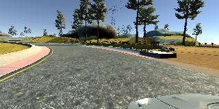
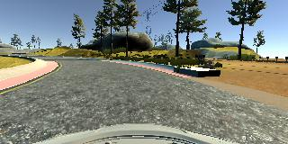
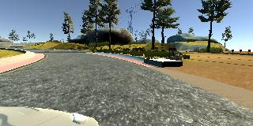
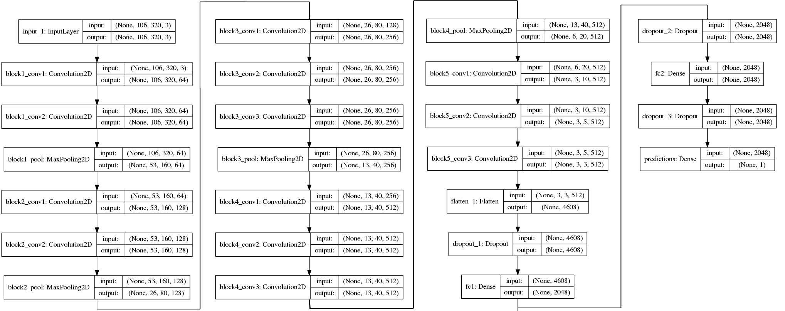

# Behavioral Cloning

Track 1                       |  Track 2
:----------------------------:|:------------------------------:
 | 

# Getting Started
## Prerequisites

This project requires **Python 3.5** and the following Python libraries installed:

- [NumPy](http://www.numpy.org/)
- [SciPy](https://www.scipy.org/)
- [matplotlib](http://matplotlib.org/)
- [pandas](http://pandas.pydata.org/)
- [TensorFlow](http://tensorflow.org)
- [Keras](https://keras.io/)
- [h5py](http://www.h5py.org/)

Only needed for driving in the simulator:

- [flask-socketio](https://flask-socketio.readthedocs.io/en/latest/)
- [eventlet](http://eventlet.net/)
- [pillow](https://python-pillow.org/)

## Run The Drive Script
## Retrain The Model
# Structure
## Data

Left                                   |  Center                                   |  Right
:-------------------------------------:|:-----------------------------------------:|:-------------------------------------:
 | |

## Model

<a href="https://raw.githubusercontent.com/pkern90/behavioral-cloning/master/images/model_wide.png" target="_blank"></img> </a>
